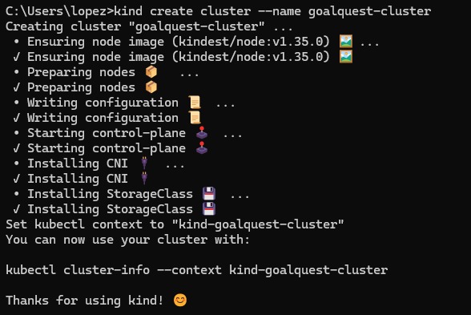

> Paso a paso para configuración de service mesh para el proyecto

# Ver los clusters que se tienen

```sh
kubectl config get-clusters
```

# Eliminar clusters antiguos

Tenia 2 clusters de otros proyectos que no se utilizaban para iniciar desde cero se eliminaron.

```sh
kind delete cluster --name istio-cluster
kind delete cluster --name kind-istio
```

# 1. Crear un cluster

```sh
kind create cluster --name goalquest-cluster
```


Como se puede ver en la salida del comando, dice: `Set kubectl context to "kind-goalquest-cluster"`, entonces kubectl ya apunta automáticamente al nuevo cluster, no se necesita cambiar contexto manualmente y ya se puede empezar a usar Kubernetes.

# 2. Instalar istio en el cluster, para poder aplicar el service mesh

```sh
# Primero verificar versión
istioctl version
# Instlar istio dentro del cluster
istioctl install --set profile=demo -y
# Verificar
kubectl get pods -n istio-system
```

# 3. Crear namespace

Es necesario crear namespace para que de esta forma se pueda hacer la inyección de automática de sidecars para agregar los envoys a cada pod.

```sh
kubectl create namespace goalquest
```

# 4. Habilitar el sidecar injection

```sh
kubectl label namespace goalquest istio-injection=enabled
```

De esta forma todos los pods que se desplieguen dentro de este cluster tendran un envoy sidecar.
Verificar la etiqueta:

```sh
kubectl get namespace goalquest --show-labels
```

Verificar el contexto:

```sh
kubectl config current-context
```

# Comandos importantes:

```sh
# Verificar pods
kubectl get pods -n goalquest
# Ver configuración y eventos de un pod
kubectl describe pod <POD-NAME> -n goalquest
# Ver los logs de un pod
kubectl logs <POD-NAME> -n goalquest
# Ver información de un pod
kubectl describe deployment task-service -n goalquest
# Construir una imagen
docker build -t goalquest/task-service:latest -f Dockerfile.prod .
# Construir imagen sin cache
docker build --no-cache -t goalquest/task-service:latest \
  -f Dockerfile.prod .
# Actualizar o subir una imagen a kind
kind load docker-image goalquest/task-service:latest --name goalquest-cluster
# Reiniciar el deployment de un servicio
kubectl rollout restart deployment task-service -n goalquest
# Verificar la parte de seguridad
kubectl get peerauthentication -n goalquest
```
